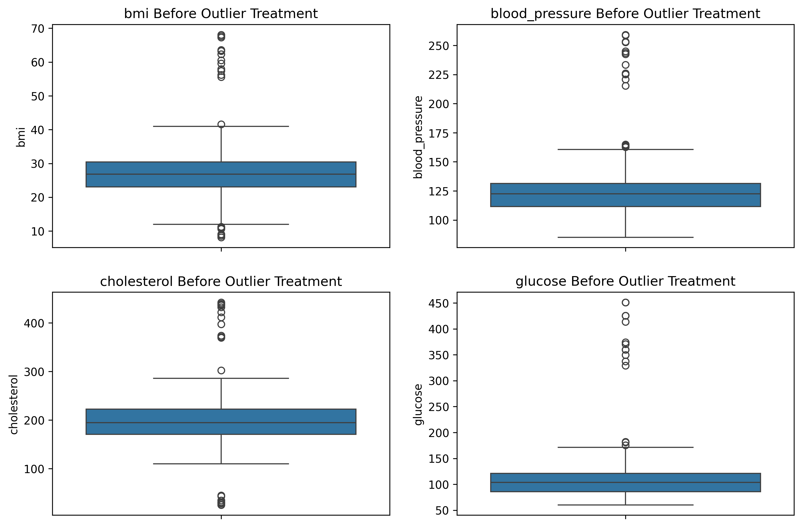
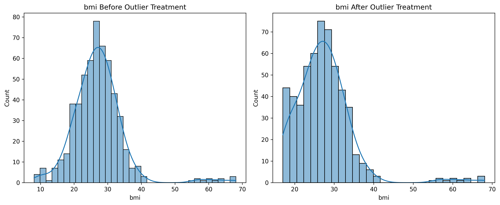
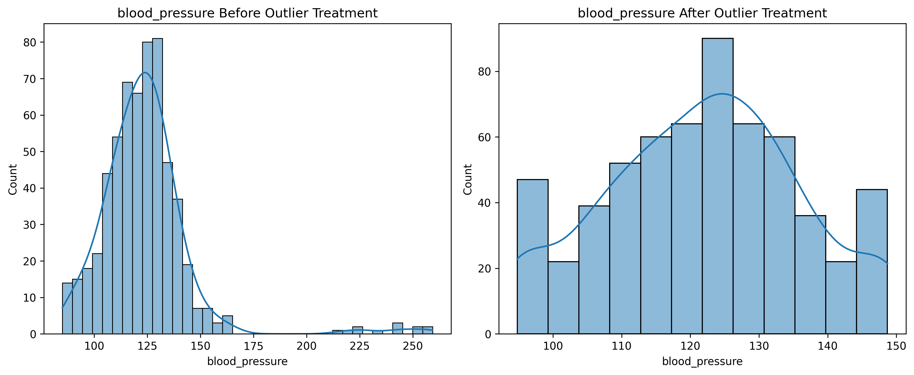
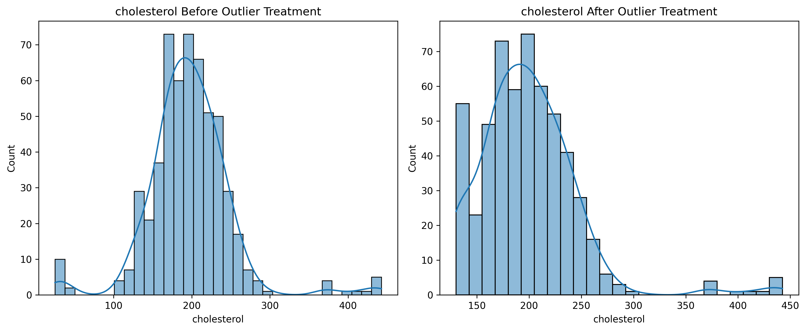
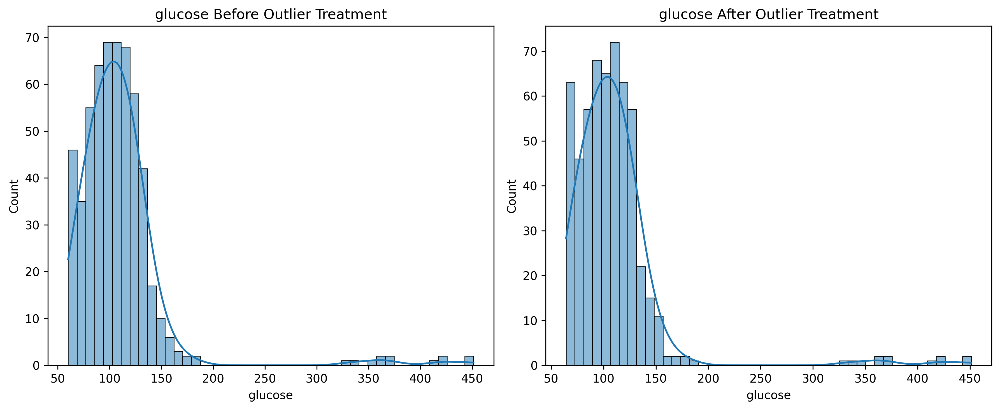

<div align="center">

# 🩺 Missing Value Imputation & Outlier Analysis
### Data Preprocessing on a Patient Health Records Dataset

[](https://github.com/HarshalVora86/Missing_Value_Imputation_Outlier_Analysis)


</div>

## 📌 Objective

This project applies data preprocessing techniques to a patient health records dataset in order to handle missing values and treat outliers. Multiple imputation and outlier-treatment methods are compared, and a final clean dataset is produced that is suitable for further analysis or machine learning.

## 🎥 Project Overview Video

A walkthrough of this project is available here: https://drive.google.com/file/d/1UacevAK2wzFMB3eoPs2-5SIUbioWN519/view?usp=sharing

## 📊 Dataset Description

The dataset contains patient health records with the following columns:

- **Numerical:** `age`, `bmi`, `blood_pressure`, `cholesterol`, `glucose`
- **Categorical:** `gender`, `region`
- **Target:** `disease_risk` (binary: 0 or 1, no missing values)

Missing values are present in the numerical columns (`bmi`, `cholesterol`, `glucose`) and categorical columns (`gender`, `region`), and outliers are present in `bmi`, `blood_pressure`, `cholesterol`, and `glucose`.

A missing-value heatmap was generated first to visualize which columns and rows contain incomplete records.

## 🧩 Part A – Handling Missing Values

Several imputation techniques were applied and compared:

- **Simple Imputer (Numerical):** Missing values in `bmi` imputed using the column mean.
- **Simple Imputer (Categorical):** Missing values in `region` and `gender` imputed using the most frequent category.
- **Missing Indicator + Random Sample Imputation:** Binary missing-indicator columns (`bmi_missing`, `cholesterol_missing`, `glucose_missing`) were created, then missing values were filled using randomly sampled values from the same column's observed data.
- **KNN Imputer:** Missing values in `age`, `bmi`, `blood_pressure`, `cholesterol`, and `glucose` estimated using the 5 nearest neighbors based on the other numerical features.
- **MICE (Iterative Imputer):** Missing values in the same numerical columns estimated iteratively using relationships between all the variables (10 iterations).

## 📦 Part B – Handling Outliers

Outliers were first visualized using boxplots across the four affected numerical columns:

<div align="center">



*Boxplots of BMI, blood pressure, cholesterol, and glucose showing potential outliers*

</div>

Four outlier detection/treatment methods were then applied and compared:

- **Z-Score Method:** Rows with a Z-score magnitude greater than 3 in `cholesterol` and `glucose` were removed.
- **IQR Method:** Values in `bmi` falling outside `Q1 − 1.5×IQR` and `Q3 + 1.5×IQR` were removed.
- **Percentile Method:** Values in `bmi`, `blood_pressure`, `cholesterol`, and `glucose` were clipped to the 1st and 99th percentiles.
- **Winsorization:** Values in the same four columns were capped at the 5th and 95th percentiles using `scipy.stats.mstats.winsorize`, preserving all rows while reducing the influence of extreme values.

### Before vs. After Comparison

The dataset shape, summary statistics, and distributions were compared before and after outlier treatment. Winsorization was chosen as the final treatment method since it reduces the effect of extreme values without dropping any records.

<div align="center">



*BMI distribution before and after winsorization*

<br><br>



*Blood pressure distribution before and after winsorization*

<br><br>



*Cholesterol distribution before and after winsorization*

<br><br>



*Glucose distribution before and after winsorization*

</div>

## ✅ Part C – Final Clean Dataset

A separate copy of the original dataset was used to build the final cleaned version:

- **Numerical columns** (`age`, `bmi`, `blood_pressure`, `cholesterol`, `glucose`) were imputed using **MICE**, since it leverages relationships between multiple numerical variables.
- **Categorical columns** (`gender`, `region`) were imputed using **most frequent imputation**.
- **Outlier treatment** was applied to `bmi`, `blood_pressure`, `cholesterol`, and `glucose` using **Winsorization** (5th–95th percentile caps).
- The `disease_risk` target column was left unchanged.
- The dataset retained its original number of rows throughout the cleaning process, with all missing values resolved.

The final cleaned dataset was exported as `final_clean_patient_dataset.csv`.

## 🛠️ Tech Stack

- **Python** – core programming language
- **Pandas & NumPy** – data manipulation and numerical computation
- **Scikit-learn** – `SimpleImputer`, `KNNImputer`, `IterativeImputer` (MICE), `MissingIndicator`
- **SciPy** – Winsorization (`scipy.stats.mstats.winsorize`)
- **Seaborn & Matplotlib** – missing-value heatmaps, boxplots, and distribution histograms
- **Jupyter Notebook** – interactive analysis environment

## 📁 Folder Structure

```
Missing_Value_Imputation_Outlier_Analysis/
├── Dataset/
│   └── patient_health_records.csv
├── Screenshots/
│   ├── Box_plots.png
│   ├── bmi_before_after_winsorization.png
│   ├── blood_pressure_before_after_winsorization.png
│   ├── cholesterol_before_after_winsorization.png
│   └── glucose_before_after_winsorization.png
├── Data_Cleaner.ipynb
├── Data_Cleaner.pdf
├── final_clean_patient_dataset.csv
└── README.md
```

## 📄 Project Files

- `Data_Cleaner.ipynb` – complete notebook with missing value imputation, outlier treatment, and final dataset generation
- `Data_Cleaner.pdf` – theory report covering missing values, missing indicators, outlier detection, and outlier treatment methods
- `Dataset/patient_health_records.csv` – original raw patient dataset
- `final_clean_patient_dataset.csv` – final cleaned dataset after imputation and outlier treatment

## 🔗 Connect

[](https://www.linkedin.com/in/harshal-vora-344601251/)
